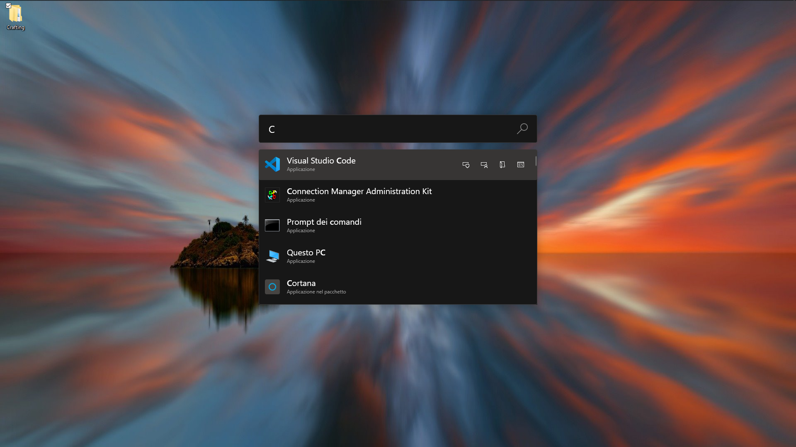
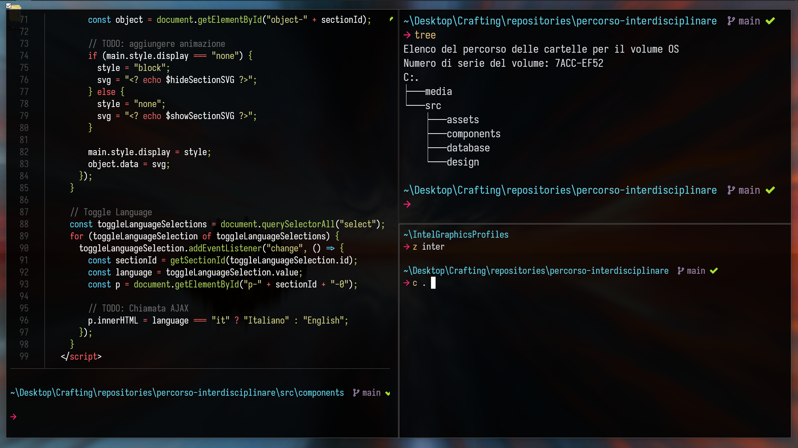
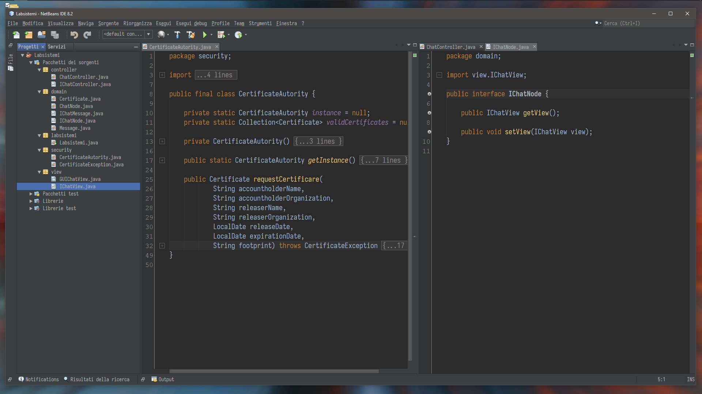

# Configurazione Windows 10



## Window Manager 
La feature [Fancy Zones](https://learn.microsoft.com/en-us/windows/powertoys/fancyzones) di [Microsoft PowerToys](https://learn.microsoft.com/it-it/windows/powertoys/install) permette di gestire il layout delle finestre tramite shortcut imitando il risultato dei [Tailing Window Manager](https://en.wikipedia.org/wiki/Tiling_window_manager)


Root directory `~`:
```ps1
...
d----        31/03/2023     09:18                  .config
d----        12/02/2023     17:17                  .docker
d----        12/02/2023     03:25                  .vscode
d----        05/05/2023     00:20                  .vscode-cli
d----        01/05/2023     18:13                  Apple
d----        04/04/2023     21:29                  Archive
d-r--        13/05/2023     23:16                ﲾ  Desktop
d----        12/05/2023     20:46                  Development
d-r--        13/05/2023     23:08                  Documents
d-r--        09/05/2023     13:11                  Downloads
d----        06/05/2023     08:34                  Home
d----        12/02/2023     03:32                  scoop
d-r--        13/05/2023     14:52                  Videos
-a---        13/05/2023     22:25                  .bash_history
-a---        13/05/2023     14:52                  .cdHistory
-a---        13/05/2023     22:50                  .gitconfig
...
```
- Nella directory `.config` sono contenuti i file di configurazione (e.g. [`user_profiles`](./Powershell/user_profiles))
- Nella directory `Archive` sono contenuti i file archiviati (progetti conclusi, documentazione etc.)
- Nella directory `Home`sono contenuti i file e i progetti di uso quotidiano (vault obsidian, appunti etc.)
- Nella directory `Development` sono contenuti i file e i progetti di sviluppo software 
- Le restanti directory sono utility di sistema o default folder

## Installazione delle applicazioni
L'installazione e il mantenimento degli applicativi viene semplificato attraverso l'utilizzo dei package manager [`winget`](https://winget.run/) e [`scoop`](https://scoop.sh/)

```ps1
winget install -e --id Git.Git;
winget install -e --id Microsoft.DotNet.SDK.7;
winget install -e --id Oracle.JavaRuntimeEnvironment;
winget install -e --id Oracle.JDK.19;

winget install -e --id Microsoft.VisualStudioCode;
winget install -e --id Microsoft.WindowsTerminal;
winget install -e --id Microsoft.PowerShell;
winget install -e --id Notepad++.Notepad++;
winget install -e --id Obsidian.Obsidian;

winget install -e --id Docker.DockerDesktop
winget install -e --id OpenJS.NodeJS
winget install -e --id Python.Python.3.9

winget install -e --id Microsoft.PowerToys;
winget install -e --id OBSProject.OBSStudio;
winget install -e --id ShareX.ShareX;

winget install -e --id Brave.Brave;
winget install -e --id Discord.Discord;
winget install -e --id Spotify.Spotify;

# Scoop Package Manager
Set-ExecutionPolicy RemoteSigned -Scope CurrentUser
irm get.scoop.sh | iex

# CLI Application
scoop install oh-my-posh fzf curl jq sudo dark gcc make tar gpg neovim

# Fonts
scoop install Iosevka-NF JetBrainsMono-NF FantasqueSansMono-NF Hack-NF Cascadia-Code
```

## Configurazione Powershell


Modificare la variabile `$CURRENTPROFILE` all'interno del file [`Microsoft.PowerShell_profile.ps1`](PowerShell/Microsoft.PowerShell_profile.ps1) specificando il percorso del [profilo](https://learn.microsoft.com/en-us/powershell/module/microsoft.powershell.core/about/about_profiles?view=powershell-7.3) desiderato
```ps1

# Variabili
$USER = $env:USERPROFILE
$CONFIG = "$USER\.config"
$POWERSHELL_PROFILES = "$CONFIG\user_profiles"
$CURRENTPROFILE = "$POWERSHELL_PROFILES\user_profile.ps1"
$VAULTS = "$USER\Home\Vaults"

# Esecuzione profilo "$POWERSHELL_PROFILES\user_profile.ps1"
. $CURRENTPROFILE
```

### Profilo Powershell
Modificare il file [`user_profile.ps1`](./PowerShell/user_profiles/user_profile.ps1) secondo le proprie esigenze. Copiare la directory [`user_profiles`](/PowerShell/user_profiles/) nella directory `.config`

```ps1
# Posh
Import-Module posh-git

# Icone
Import-Module Terminal-Icons

# Auto Completition
Set-PSR
eadLineOption -PredictionSource History
Set-PSReadLineOption -PredictionViewStyle List
Set-PSReadLineOption -EditMode Emacs
Set-PSReadLineOption -BellStyle None
Set-PSReadLineKeyHandler -Chord 'Ctrl+d' -Function DeleteChar
Set-PSReadlineKeyHandler -Key Tab -Function MenuComplete

# Fuzzy Finder
Set-PsFzfOption -PSReadlineChordProvider 'Ctrl+f' -PSReadlineChordReverseHistory 'Ctrl+r'

# Shell
oh-my-posh get shell

# Alias
Set-Alias alias Set-Alias
Set-Alias s scoop
Set-Alias v nvim
Set-Alias c code
Set-Alias g git
Set-Alias n node
Set-Alias x explorer
Set-Alias l ls
Set-Alias ll ls
Set-Alias touch New-Item
Set-Alias unzip Expand-Archive
Set-Alias grep findstr
Set-Alias less 'C:\Program Files\Git\usr\bin\less.exe'

# Utilities
function cl { cat $args | less }
function which { Get-Command -Name $args -ErrorAction SilentlyContinue | Select-Object -ExpandProperty Path -ErrorAction SilentlyContinue }

# Symbolic Links
function filemklink { cmd /c mklink $args[0] $args[1] }
function dirmklink { cmd /c mklink /d $args[0] $args[1] }

# Themes
$ThemesPath = "$POWERSHELL\themes\"
$Themes = Get-ChildItem $ThemesPath -Name

$ThemeName = 'adamnorwood.omp.json'
# $ThemeName = 'capr4n.omp.json'
# $ThemeName = 'angularic.omp.json'
# $ThemeName = 'atomic.omp.json'
# $ThemeName = 'blueish.omp.json'
# $ThemeName = 'catppuccin_latte.omp.json'
# $ThemeName = 'craver.omp.json'
# $ThemeName = 'hul10.omp.json'
# $ThemeName = 'tiwahu.omp.json'

$ThemePath = -join($ThemesPath,  $ThemeName)

function Theme { $ThemePath = -join($ThemesPath, $args[0]); oh-my-posh init pwsh --config $ThemePath | Invoke-Expression }
Theme $ThemeName

# Docker LAMP Environment
function lamp-start {
    docker start lamp-redis
    docker start lamp-mysql8
    docker start lamp-phpmyadmin
    docker start lamp-php8
}

function lamp-stop {
    docker stop lamp-redis
    docker stop lamp-mysql8
    docker stop lamp-phpmyadmin
    docker stop lamp-php8
}

clear
```

## Configurazione VSCode

Importare la configurazione: `Manage > Profile > Import` > [`VSCode/Default.code-profile`](VSCode/Default.code-profile)

## Configurazione Netbeans
- Installare `JDK 8`
- Installare `Netbeans 8.2`
- Importare tema: `Tools` > `Plugins` > `Installed` > [`Netbeans/darcula.nbm`](Netbeans/darcula.nbm)
- Importare la configurazione: `Tools` > `Options` > `Import` > [`Netbeans/netbeans-config.zip`](Netbeans/netbeans-config.zip)
- (Installare plugin: `Tools` > `Plugins` > `Installed` > `plugin.nbm`)

## Configurazione Obsidian 

Copiare il contenuto della directory [Obsidian/](Obsidian/) all'interno della cartella Vault